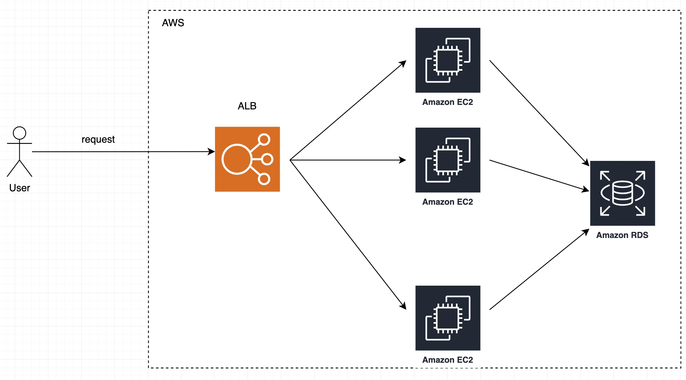

# Solution for problem 2: Building Castle In The Cloud

## Calculate the resource:
    - p99 response time of <100ms < 100ms
        => 1 server can handle at least 1000ms / 100ms = 10 request (per second)
        => it take 50 servers to handle 500 request per second

1. An overview diagram of the services used and what role they play in the system.
    Using AWS ALB as a load balancer and 50 AWS EC2 as a web server
    - 

2. Elaboration on why each cloud service is used and what are the alternatives considered
    - AWS ALB as a load balancer
    - 50 AWS EC2 as a web server
    - AWS RDS for database

3. Plans for scaling when the product grows beyond your current setup.
    - Using horizon scaling, adding more EC2 to handle more request
