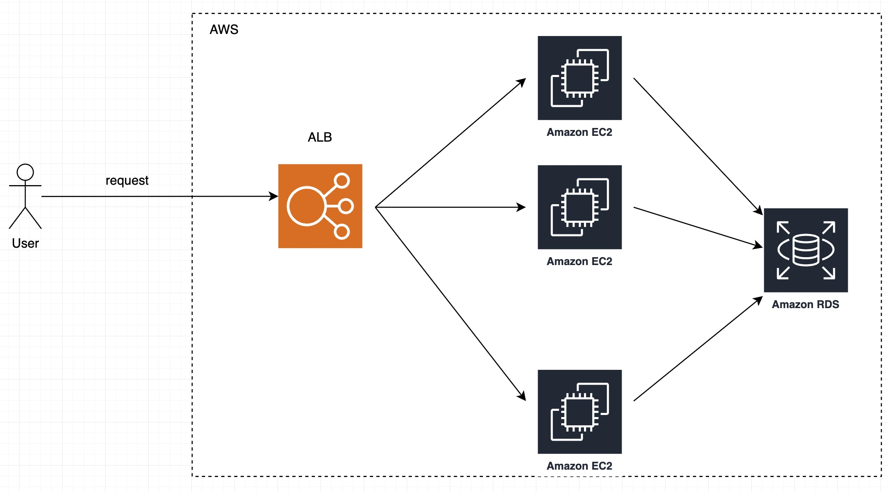

# Problem 2: Building Castle In The Cloud
Duration: You should not spend more than 12 hours on this problem.
Time estimation is for internship roles, if you are a software professional you should spend significantly less time.

# Task
Architecture a highly available trading system with similar features to the Binance trading platform https://www.binance.com. This system will need to be resilient to failures, scalable, and cost-effective. You should design the architecture, choose the appropriate technologies, and explain your approach for maintaining high availability and scalability.
Due to time constraint, you will not be able to cover every feature on the reference platform, so choose some features that will help you demonstrate your mastery of cloud infrastructure.
Deliverables

# Your submission should include:
- An overview diagram of the services used and what role they play in the system.
- Elaboration on why each cloud service is used and what are the alternatives considered.
- Plans for scaling when the product grows beyond your current setup.

# Specifications
You are limited to the following constraints for your plan.
Cloud Provider
Amazon Web Services (AWS)
Throughput: 500 requests per second
Response Time: p99 response time of <100ms

t < 100ms => 1 server can handle at least 1000ms / 100ms = 10 request (per second) => it take 50 servers to handle 500 request per second.

Solution:

1. An overview diagram of the services used and what role they play in the system.
    Using AWS ALB as a load balancer and 50 AWS EC2 as a web server
    - 

2. Elaboration on why each cloud service is used and what are the alternatives considered
    - AWS ALB as a load balancer
    - AWS EC2 as a web server

3. Plans for scaling when the product grows beyond your current setup.
    - Using horizon scaling, adding more EC2 to handle more request
